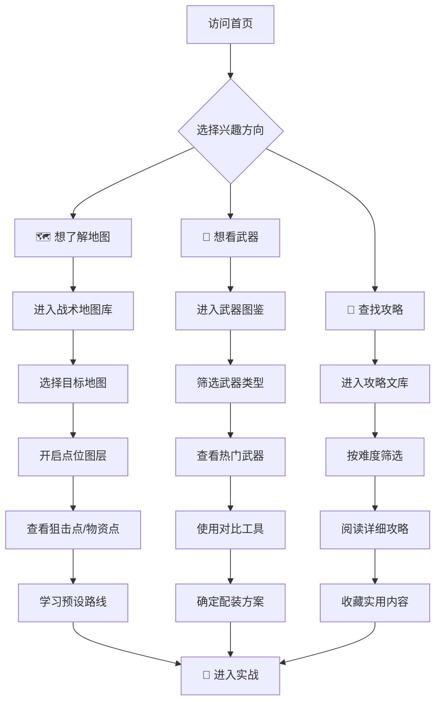
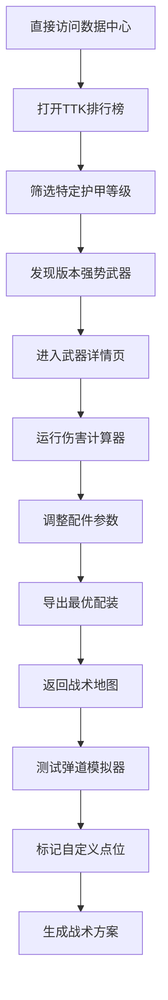

# 三角洲行动（Delta Force）游戏攻略网站 - 产品需求文档

## 1. 产品概述

一款专为**三角洲行动（Delta Force）**战术射击游戏打造的**沉浸式军事风格攻略平台**，采用纯静态网页技术栈，以**交互式战术地图**和**数据可视化武器分析**为核心差异化特色，服务于从新手到硬核玩家的全层级用户群体。

- **核心价值**：解决传统游戏攻略网站信息分散、缺乏互动性、视觉平庸的问题，提供**战场级沉浸感**的专业攻略体验
- **市场定位**：高端垂直游戏攻略社区，主打**军事美学 + 数据驱动 + 战术深度**

---

## 2. 目标人群深度分析

### 2.1 核心用户画像

| 用户类型 | 占比 | 核心需求 | 行为特征 | 内容偏好 |
|---------|------|---------|---------|---------|
| **新手指挥官** | 35% | 快速上手、基础教学 | 频繁搜索、需要引导 | 操作教程、模式介绍、装备推荐 |
| **战术进阶者** | 40% | 提升技术、团队配合 | 深度阅读、反复观看 | 地图策略、枪械配件、战术打法 |
| **硬核特种兵** | 20% | 极限优化、数据挖掘 | 专业分析、社区分享 | 数据对比、竞速记录、隐藏机制 |
| **回归老兵** | 5% | 版本更新、新内容 | 快速浏览、重点查看 | 更新日志、新武器/地图解析 |

### 2.2 用户痛点分析

**传统游戏攻略网站的通病：**
1. ❌ **信息碎片化** - 攻略散落在论坛、视频、Wiki各处
2. ❌ **缺乏交互性** - 纯文字图片，无法直观理解战术
3. ❌ **视觉同质化** - 千篇一律的蓝白配色，无游戏氛围
4. ❌ **数据不透明** - 武器参数只有文字描述，无法横向对比
5. ❌ **更新滞后** - 版本迭代后攻略未及时更新

### 2.3 我们的解决方案

✅ **一站式整合** - 所有攻略集中展示，分类清晰  
✅ **交互式体验** - 可点击的战术地图、可拖拽的武器对比  
✅ **军事沉浸感** - 橄榄绿/沙漠黄主色调，HUD界面元素  
✅ **数据可视化** - 图表化武器属性，一目了然  
✅ **版本同步** - 醒目的更新标记，快速定位新内容  

---

## 3. 核心功能模块

### 3.1 功能架构总览

```
┌─────────────────────────────────────────────────────────────┐
│                    🎯 三角洲行动攻略站                        │
├─────────────┬─────────────┬─────────────┬───────────────────┤
│   🗺️ 战术    │   🔫 武器    │   📖 攻略    │   📊 数据         │
│   地图库     │   图鉴       │   文章      │   中心            │
├─────────────┼─────────────┼─────────────┼───────────────────┤
│ • 交互式地图  │ • 全武器数据库 │ • 新手指南  │ • 伤害计算器      │
│ • 点位标注   │ • 配件推荐   │ • 进阶战术  │ • 弹道模拟器      │
│ • 路线规划   │ • 属性对比   │ • 团队配合  │ • TTK排行榜       │
│ • 视角切换   │ • 皮肤展示   │ • 模式解析  │ • 胜率统计        │
└─────────────┴─────────────┴─────────────┴───────────────────┘
                              ↓
              ┌───────────────────────────────┐
              │        ⚡ 特色功能             │
              │  • 实时战况模拟器（CSS动画）    │
              │  • HUD风格的导航系统           │
              │  • 军事术语词典                │
              │  • 战术板（战术绘制工具）       │
              └───────────────────────────────┘
```

### 3.2 页面功能详情

#### 页面1：首页（Home Page）

| 模块名称 | 功能描述 | UI元素 |
|---------|---------|--------|
| **Hero区域** | 全屏军事风格Banner，动态粒子背景（模拟战场烟尘），标语："**成为战场上的幽灵**" | 深色背景 + 绿色激光扫描线动画 + 等宽字体倒计时 |
| **快速入口** | 4个核心模块卡片：战术地图、武器图鉴、攻略文库、数据中心 | 六边形蜂巢布局，悬停时边框发光 |
| **最新攻略** | 滚动展示最近更新的攻略文章（横向滚动） | 卡片式布局，左上角显示"NEW"标签 |
| **热门武器TOP10** | 当前版本最强武器排行 | 垂直条形图，带数值标签 |
| **版本动态** | 最新补丁日志摘要 | 时间轴样式，可展开详情 |

#### 页面2：战术地图库（Tactical Maps）

| 模块名称 | 功能描述 | UI元素 |
|---------|---------|--------|
| **地图选择器** | 缩略图网格，点击进入具体地图 | 悬停显示地图名称和模式支持 |
| **交互式地图主体** | **核心差异化功能** - 可缩放/拖拽的地图，点击点位显示详细信息 | Canvas/SVG实现，类似Google Maps体验 |
| **图层控制** | 切换显示：狙击点、掩体、物资点、出生点、撤离点 | 右侧浮动面板，复选框控制 |
| **战术路线** | 预设进攻/防守路线，带箭头动画 | SVG路径 + CSS动画 |
| **视角切换** | 俯视图/等距视图/3D透视（CSS 3D transform） | 底部按钮组 |
| **地图信息卡** | 地图尺寸、推荐人数、适用模式 | 左下角固定卡片 |

#### 页面3：武器图鉴（Weapon Arsenal）

| 模块名称 | 功能描述 | UI元素 |
|---------|---------|--------|
| **武器分类Tab** | 突击步枪/狙击枪/冲锋枪/霰弹枪/手枪/机枪 | 顶部标签栏，图标+文字 |
| **武器网格** | 卡片式展示所有武器，显示基础属性预览 | 网格布局，悬停翻转显示背面详情 |
| **武器详情页** | 点击进入详情：完整属性、配件槽位、推荐配装、实战视频 | 左侧大图 + 右侧数据面板 |
| **武器对比器** | **核心差异化** - 选择2-3把武器进行属性雷达图对比 | 拖拽添加，实时更新雷达图 |
| **伤害计算器** | 输入距离/护甲等级，计算实际伤害 | 交互式表单 + 结果可视化 |
| **后坐力演示** | CSS动画模拟不同武器的后坐力图案 | Canvas绘制弹道散布 |

#### 页面4：攻略文库（Strategy Library）

| 模块名称 | 功能描述 | UI元素 |
|---------|---------|--------|
| **分类筛选** | 按难度（初级/中级/高级）、类型（单人/团队）、模式筛选 | 多选标签云 |
| **搜索框** | 关键词搜索攻略标题和内容 | 军事风格输入框，回车键触发 |
| **攻略列表** | 卡片列表，显示标题、难度标签、阅读时长、更新日期 | 左侧彩色条表示难度 |
| **攻略详情页** | Markdown渲染的长文，支持目录跳转、代码高亮（配置文件） | 侧边固定目录 + 主内容区 |
| **相关推荐** | 底部显示同类攻略 | 横向滚动卡片 |
| **收藏功能** | LocalStorage保存收藏的文章（纯前端） | 心形图标，点击变色 |

#### 页面5：数据中心（Data Hub）

| 模块名称 | 功能描述 | UI元素 |
|---------|---------|--------|
| **TTK排行榜** | 击杀时间排名（按护甲等级分类） | 排序表格，支持升降序 |
| **弹道模拟器** | **创新功能** - 可视化子弹下坠、速度衰减 | 交互式Canvas，调节参数 |
| **伤害分布图** | 不同部位伤害倍率热力图 | 人形轮廓SVG + 渐变填充 |
| **配件影响计算** | 计算枪口/枪管/瞄具对属性的影响权重 | 饼图/柱状图组合 |
| **版本对比** | 对比两个版本的武器数值变化 | 差异高亮表格 |

---

## 4. 核心用户流程

### 4.1 主流程（新手用户路径）



### 4.2 高级用户流程（硬核玩家路径）



---

## 5. 用户界面设计规范

### 5.1 设计风格定义：**军事科技风（Military Tactical Tech）**

#### 视觉调性关键词：
- **硬核** - 不妥协的专业感
- **精准** - 数据驱动的清晰度
- **沉浸** - 身临其境的战场氛围
- **高效** - 信息密度与可读性的平衡

#### 色彩系统（Military Palette）：

| 用途 | 色值 | 说明 |
|------|------|------|
| **主背景** | `#0a0f0d` (深墨绿) | 接近黑色的深绿，营造夜间作战氛围 |
| **次背景** | `#141f1a` (暗绿灰) | 卡片、面板背景色 |
| **主色调** | `#00ff41` (荧光绿) | HUD界面标准绿，用于强调、链接、重要数据 |
| **辅助色** | `#ffd700` (金黄) | 警告、稀有物品、VIP标识 |
| **危险色** | `#ff3333` (警报红) | 错误提示、敌人标记、减益效果 |
| **信息色** | `#00bfff` (天蓝) | 中立信息、友军标记、普通链接 |
| **文字主色** | `#e0e0e0` (浅灰白) | 主要文本 |
| **文字次色** | `#8a8a8a` (中灰) | 次要文本、说明文字 |

#### 字体系统（Typography）：

| 用途 | 字体 | 特征 |
|------|------|------|
| **标题字体** | `Orbitron` / `Rajdhani` | 未来科技感，等宽特征，适合数字显示 |
| **正文字体** | `Share Tech Mono` / `Roboto Mono` | 等宽字体，终端/代码风格，增强军事感 |
| **数据字体** | `Chakra Petch` | 清晰易读，适合表格和数字密集区域 |
| **装饰字体** | `Black Ops One` | 军事 stencil 风格，用于特殊标题 |

#### 组件风格（Component Style）：

| 元素 | 样式描述 |
|------|---------|
| **按钮** | 直角或小圆角(2px)，边框1px实线，悬停时填充颜色+发光效果，按下时内阴影 |
| **卡片** | 深色背景 + 1px边框(#1a2f23) + 微弱投影，悬停时边框变为主色调 + 上浮动画 |
| **输入框** | 深色填充 + 下划线样式聚焦，占位符使用半透明主色调 |
| **表格** | 斑马纹行（交替#141f1a和透明），悬停行高亮，排序图标使用箭头 |
| **标签/Tag** | 小尺寸胶囊形，左侧竖条颜色区分类型（绿=初级，黄=中级，红=高级） |
| **进度条** | 技能条样式，分段显示，填充部分使用渐变或条纹动画 |
| **图标** | 线性图标（Lucide/Phosphor），描边宽度2px，颜色跟随主题 |
| **加载动画** | 雷达扫描效果（圆形旋转扫描线）或打字机效果（逐字显示） |

#### 特殊视觉效果：

1. **扫描线效果（Scanlines）** - 整体页面覆盖微弱的CRT扫描线纹理（opacity: 0.03）
2. **网格背景（Grid Pattern）** - 使用CSS repeating-linear-gradient创建战术网格
3. **故障效果（Glitch）** - 标题文字偶尔出现轻微的RGB偏移抖动（CSS animation）
4. **呼吸光效（Breathing Glow）** - 重要元素的边框或阴影周期性明暗变化
5. **数据流动画（Data Stream）** - 装饰性的二进制数字或十六进制代码缓慢滚动

### 5.2 各页面UI设计要点

#### 首页UI要点：
- Hero区域高度100vh，背景使用**多层叠加**：深色底 → 网格图案 → 粒子Canvas（可选）→ 渐变遮罩
- 导航栏采用**顶部固定**，半透明背景(black, opacity: 0.8)，毛玻璃效果(backdrop-filter: blur)
- 快速入口使用**六边形网格**（CSS clip-path实现），打破传统矩形布局
- 最新攻略区域使用**横向滚动容器**，鼠标滚轮控制，触摸滑动友好

#### 战术地图页UI要点：
- 地图容器占据屏幕70%高度，右侧/底部浮动工具栏
- 地图上的点位使用**脉冲动画标记**（CSS keyframes: scale + opacity）
- 图层控制面板采用**玻璃态设计**（glassmorphism）：半透明 + 模糊 + 细边框
- 底部信息栏显示当前坐标、缩放级别（模仿GPS设备界面）

#### 武器图鉴页UI要点：
- 武器卡片采用**双面翻转效果**（CSS 3D transform）：正面显示外观+基础属性，背面显示详细数据
- 详情页左侧武器大图使用**全息投影效果**：底部反射渐变 + 扫描线动画
- 雷达图使用Canvas/SVG绘制，6个维度：伤害、射程、射速、稳定性、便携、载弹量
- 对比工具采用**拖拽区域**设计，从武器列表拖入对比槽位

#### 攻略文库页UI要点：
- 文章列表左侧使用**4px彩色竖条**作为视觉锚点，颜色代表难度等级
- 详情页采用**双栏布局**：左侧固定目录（sticky），右侧主内容区（max-width: 800px）
- 代码块使用**终端风格**：深黑背景 + 绿色文字 + 窗口控制按钮（红黄圆点）
- 引用块使用**军事引文格式**：左侧粗边框 + "INTEL REPORT"标签

#### 数据中心页UI要点：
- 图表使用**自定义配色**（非Chart.js默认配色），主色调为荧光绿
- 表格采用**等宽字体**显示数字，右对齐，千分位逗号分隔
- 弹道模拟器使用**深色Canvas** + 荧光绿轨迹线 + 实时参数面板
- 排行榜前3名使用**金银铜渐变**背景条（gold/silver/bronze gradients）

### 5.3 响应式设计策略

| 设备断点 | 布局调整 | 交互优化 |
|---------|---------|---------|
| **Desktop** (≥1200px) | 多列网格，侧边栏固定，完整功能 | 鼠标悬停效果，键盘快捷键支持 |
| **Tablet** (768px-1199px) | 双列布局，折叠侧边栏，简化工具栏 | 触摸手势（捏合缩放地图），滑动切换Tab |
| **Mobile** (<768px) | 单列堆叠，汉堡菜单，底部导航栏 | 大触控目标(44px+)，滑动手势，简化交互 |

**移动端特殊处理：**
- 导航栏变为**底部TabBar**（更符合手机操作习惯）
- 地图改为**全屏模式**，工具栏收起到右下角悬浮按钮
- 武器对比限制为**2把武器**（屏幕空间有限）
- 表格改为**卡片列表**（每行数据转为卡片展示）

---

## 6. 差异化竞争优势总结

### 🆚 与传统游戏攻略网站的对比

| 维度 | 传统攻略站（如NGA、游民星空） | **我们的方案** |
|------|---------------------------|--------------|
| **视觉风格** | 通用模板，蓝白配色，广告横幅 | 军事科技风，沉浸式HUD界面，零广告 |
| **地图展示** | 静态图片 + 文字描述 | **交互式地图**，可点击/缩放/切换图层 |
| **武器数据** | 文字表格，手动对比 | **可视化图表**，雷达图对比，实时计算器 |
| **内容组织** | 论坛帖子，良莠不齐 | **结构化分类**，难度分级，版本标记 |
| **用户体验** | 广告干扰，加载缓慢 | **纯净体验**，纯静态秒开，PWA支持 |
| **互动性** | 仅评论区 | **本地收藏**，战术板绘制，数据模拟 |
| **更新机制** | 依赖作者更新 | **版本日志集成**，快速定位变更内容 |

### 💡 创新亮点

1. **🗺️ 交互式战术地图** - 不是静态图片，而是可操作的战术工具
2. **📊 数据驱动决策** - 用图表说话，用计算器验证，拒绝玄学配装
3. **🎨 沉浸式视觉体验** - 每个像素都服务于"身临其境"的目标
4. **⚡ 纯静态高性能** - 无需服务器，CDN部署即可全球加速
5. **🔧 开箱即用的工具集** - 伤害计算器、弹道模拟器、TTK查询...内置实用小工具

---

## 7. 技术约束与实现要求

### 7.1 技术栈要求
- ✅ **纯静态网页**（HTML/CSS/JavaScript）
- ✅ **无需后端服务**（无数据库、无API）
- ✅ **数据使用JSON/JS对象存储**（Mock Data）
- ✅ **支持现代浏览器**（Chrome/Firefox/Safari/Edge 最新版）

### 7.2 性能指标
- 首屏加载时间 < 1.5秒（3G网络）
- Lighthouse性能评分 ≥ 90
- 可访问性评分 ≥ 85
- SEO友好的语义化HTML

### 7.3 可维护性
- 模块化组件设计（易于扩展新武器/地图/攻略）
- 清晰的文件目录结构
- 详细的代码注释（中文）
- 响应式设计兼容主流设备

---

## 8. 项目交付物清单

### 必需页面（5个核心页面）
1. ✅ 首页（index.html）
2. ✅ 战术地图库（maps.html）
3. ✅ 武器图鉴（weapons.html）
4. ✅ 攻略文库（guides.html）
5. ✅ 数据中心（data.html）

### 共享组件
- 导航栏组件（响应式，含移动端汉堡菜单）
- 页脚组件（版权信息、友情链接）
- 返回顶部按钮
- 加载状态组件
- 模态框组件（用于武器详情、攻略预览）

### 静态资源
- CSS主样式文件（含变量、重置样式、通用组件）
- 各页面独立样式文件
- JavaScript主逻辑文件（路由、状态管理、工具函数）
- 各页面独立脚本文件
- 图片资源（武器图标、地图截图、UI素材）
- 字体文件（如使用自托管字体）

---

*文档版本：v1.0*  
*创建日期：2026-05-09*  
*状态：待审核*
