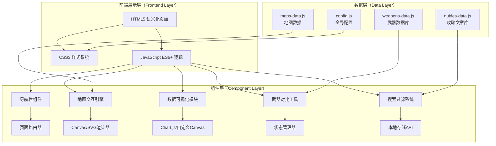

# 三角洲行动（Delta Force）游戏攻略网站 - 技术架构文档

## 1. 架构设计总览

### 1.1 系统架构图



### 1.2 技术选型理由

| 技术选型 | 选择理由 | 替代方案（未采用） |
|---------|---------|------------------|
| **纯HTML/CSS/JS** | 零依赖、秒开、SEO友好、易于部署 | React/Vue（过度工程化，对静态站过重） |
| **CSS Grid + Flexbox** | 现代布局，响应式友好 | Bootstrap（样式臃肿，定制性差） |
| **Vanilla JavaScript** | 无构建步骤，原生性能好 | TypeScript（需编译，增加复杂度） |
| **CSS Custom Properties** | 主题切换、动态样式、维护性强 | SCSS（需预处理器） |
| **Canvas API** | 地图交互、图表绘制高性能 | SVG（大数据量时性能下降） |
| **LocalStorage** | 用户收藏、偏好设置持久化 | Cookie（容量小，不够灵活） |
| **IntersectionObserver** | 滚动动画、懒加载性能优化 | Scroll事件监听（性能差） |

---

## 2. 项目目录结构

```
delta-force-guide/
│
├── index.html                  # 首页
├── maps.html                   # 战术地图库
├── weapons.html                # 武器图鉴
├── guides.html                 # 攻略文库
├── data.html                   # 数据中心
│
├── css/
│   ├── main.css               # 主样式文件（变量、重置、通用组件）
│   ├── home.css               # 首页专用样式
│   ├── maps.css               # 地图页样式
│   ├── weapons.css            # 武器页样式
│   ├── guides.css             # 攻略页样式
│   └── data.css               # 数据中心样式
│
├── js/
│   ├── app.js                 # 主应用逻辑（路由、初始化）
│   ├── router.js              # 前端路由管理器
│   ├── components/
│   │   ├── navbar.js          # 导航栏组件
│   │   ├── footer.js          # 页脚组件
│   │   ├── card.js            # 通用卡片组件
│   │   ├── modal.js           # 模态框组件
│   │   └── loading.js         # 加载动画组件
│   ├── modules/
│   │   ├── map-engine.js      # 地图交互引擎
│   │   ├── weapon-compare.js  # 武器对比工具
│   │   ├── damage-calc.js     # 伤害计算器
│   │   ├── ballistic-sim.js   # 弹道模拟器
│   │   ├── search-filter.js   # 搜索过滤系统
│   │   └── chart-renderer.js  # 图表渲染器
│   ├── utils/
│   │   ├── dom-helper.js      # DOM操作工具函数
│   │   ├── storage.js         # LocalStorage封装
│   │   ├── animator.js        # 动画工具库
│   │   └── formatter.js       # 数据格式化工具
│   └── data/
│       ├── weapons.json       # 武器数据（或转为JS对象）
│       ├── maps.json          # 地图数据
│       ├── guides.json        # 攻略文章数据
│       └── config.json        # 全局配置
│
├── assets/
│   ├── images/
│   │   ├── weapons/           # 武器图片
│   │   ├── maps/              # 地图图片
│   │   ├── icons/             # 图标资源
│   │   └── ui/                # UI装饰素材
│   ├── fonts/                 # 自托管字体（可选）
│   └── sounds/                # 音效文件（可选，UI反馈音）
│
├── README.md                  # 项目说明文档（可选）
└── .gitignore                # Git忽略规则
```

---

## 3. 路由定义（纯前端路由）

### 3.1 页面路由表

| 路由路径 | 页面名称 | 文件路径 | 描述 |
|---------|---------|---------|------|
| `/` 或 `/index.html` | 首页 | `index.html` | 网站主入口，展示核心功能 |
| `/maps` | 战术地图库 | `maps.html` | 交互式地图浏览和战术分析 |
| `/weapons` | 武器图鉴 | `weapons.html` | 武器数据库和对比工具 |
| `/guides` | 攻略文库 | `guides.html` | 分类攻略文章列表和详情 |
| `/data` | 数据中心 | `data.html` | 数据可视化和计算工具 |

### 3.2 哈希路由实现方案

由于是纯静态网站，使用**Hash Router**（URL格式：`page.html#/map/longa`）：

```javascript
// router.js 核心逻辑示例
class HashRouter {
  constructor() {
    this.routes = {};
    window.addEventListener('hashchange', () => this.handleRoute());
  }
  
  register(path, handler) {
    this.routes[path] = handler;
  }
  
  handleRoute() {
    const hash = window.location.hash.slice(1) || '/';
    const handler = this.routes[hash];
    if (handler) handler();
  }
}
```

**子页面路由示例：**
- `maps.html#longa` - 长弓溪谷地图详情
- `weapons.html#ak47` - AK-47武器详情
- `guides.html#beginner-basic` - 新手基础教程

---

## 4. 核心技术实现细节

### 4.1 CSS架构设计（ITCSS方法论）

```css
/* main.css 文件结构 */

/* ===== 1. Settings（设置层） ===== */
:root {
  /* 色彩系统 */
  --color-bg-primary: #0a0f0d;
  --color-bg-secondary: #141f1a;
  --color-accent: #00ff41;
  /* ... 更多变量 */
  
  /* 字体系统 */
  --font-display: 'Orbitron', sans-serif;
  --font-body: 'Share Tech Mono', monospace;
  /* ... */
  
  /* 间距系统 */
  --space-xs: 0.25rem;
  --space-sm: 0.5rem;
  /* ... */
  
  /* 断点系统 */
  --breakpoint-sm: 768px;
  --breakpoint-md: 1024px;
  --breakpoint-lg: 1200px;
}

/* ===== 2. Tools（工具层） ===== */
/* mixins、functions（如需要使用预处理器） */

/* ===== 3. Generic（通用层） ===== */
/* CSS Reset / Normalize */
*, *::before, *::after { box-sizing: border-box; margin: 0; padding: 0; }

/* ===== 4. Elements（元素层） ===== */
body { 
  font-family: var(--font-body);
  background-color: var(--color-bg-primary);
  color: var(--color-text-primary);
  line-height: 1.6;
}

/* ===== 5. Objects（对象层） ===== */
.container { max-width: 1400px; margin: 0 auto; padding: 0 2rem; }
.grid { display: grid; gap: 1.5rem; }

/* ===== 6. Components（组件层） ===== */
.btn { /* 按钮基础样式 */ }
.card { /* 卡片基础样式 */ }
.navbar { /* 导航栏样式 */ }

/* ===== 7. Utilities（工具类层） ===== */
.text-center { text-align: center; }
.mt-4 { margin-top: 2rem; }
.hidden { display: none; }
```

### 4.2 关键技术点实现

#### 🔸 交互式地图引擎（map-engine.js）

**技术方案：**
- 使用**HTML + CSS transform** 实现拖拽和缩放（轻量级）
- 地图点位使用**绝对定位的DOM元素**（便于添加事件和样式）
- 图层控制通过**CSS class 切换**显示/隐藏

**核心功能代码结构：**

```javascript
class MapEngine {
  constructor(containerId, mapData) {
    this.container = document.getElementById(containerId);
    this.mapData = mapData;
    this.scale = 1;
    this.position = { x: 0, y: 0 };
    this.isDragging = false;
    this.activeLayers = new Set(['spawn', 'loot']); // 默认开启图层
    
    this.init();
  }
  
  init() {
    this.renderMapBase();
    this.renderPoints();
    this.bindEvents();
    this.initControls();
  }
  
  // 渲染地图底图
  renderMapBase() {
    const mapEl = document.createElement('div');
    mapEl.className = 'map-base';
    mapEl.style.backgroundImage = `url(${this.mapData.imageUrl})`;
    this.container.appendChild(mapEl);
  }
  
  // 渲染点位标记
  renderPoints() {
    this.mapData.points.forEach(point => {
      const marker = document.createElement('div');
      marker.className = `marker marker--${point.type}`;
      marker.style.left = `${point.x}%`;
      marker.style.top = `${point.y}%`;
      marker.dataset.pointId = point.id;
      marker.innerHTML = `<span class="marker__icon">${point.icon}</span>`;
      marker.addEventListener('click', () => this.showPointDetail(point));
      this.container.appendChild(marker);
    });
  }
  
  // 拖拽功能
  bindEvents() {
    this.container.addEventListener('mousedown', (e) => this.startDrag(e));
    window.addEventListener('mousemove', (e) => this.onDrag(e));
    window.addEventListener('mouseup', () => this.endDrag());
    
    // 触摸事件支持
    this.container.addEventListener('touchstart', (e) => this.startDrag(e.touches[0]));
    this.container.addEventListener('touchmove', (e) => this.onDrag(e.touches[0]));
    this.container.addEventListener('touchend', () => this.endDrag());
  }
  
  // 缩放功能
  zoom(delta) {
    this.scale = Math.max(0.5, Math.min(3, this.scale + delta));
    this.container.style.transform = `translate(${this.position.x}px, ${this.position.y}px) scale(${this.scale})`;
  }
  
  // 图层控制
  toggleLayer(layerName) {
    if (this.activeLayers.has(layerName)) {
      this.activeLayers.delete(layerName);
    } else {
      this.activeLayers.add(layerName);
    }
    this.updateLayerVisibility();
  }
}
```

#### 🔸 武器雷达图绘制（chart-renderer.js）

**技术方案：**
- 使用**Canvas API** 手绘六边形雷达图（避免引入Chart.js依赖）
- 支持**动态数据更新**（对比时实时刷新）
- **响应式尺寸**（监听容器resize）

**实现要点：**

```javascript
class RadarChart {
  constructor(canvasId, options = {}) {
    this.canvas = document.getElementById(canvasId);
    this.ctx = this.canvas.getContext('2d');
    this.dimensions = ['damage', 'range', 'fireRate', 'stability', 'mobility', 'magSize'];
    this.labels = {
      damage: '伤害',
      range: '射程',
      fireRate: '射速',
      stability: '稳定性',
      mobility: '便携性',
      magSize: '载弹量'
    };
    this.options = {
      maxValue: 100,
      levels: 5,
      color: '#00ff41',
      fillColor: 'rgba(0, 255, 65, 0.2)',
      ...options
    };
  }
  
  draw(data) {
    const { width, height } = this.canvas.parentElement.getBoundingClientRect();
    this.canvas.width = width * window.devicePixelRatio;
    this.canvas.height = height * window.devicePixelRatio;
    this.ctx.scale(window.devicePixelRatio, window.devicePixelRatio);
    
    const centerX = width / 2;
    const centerY = height / 2;
    const radius = Math.min(width, height) / 2 - 40;
    
    this.drawGrid(centerX, centerY, radius);
    this.drawAxes(centerX, centerY, radius);
    this.drawData(centerX, centerY, radius, data);
  }
  
  // 绘制背景网格（五边形/六边形层级）
  drawGrid(cx, cy, r) {
    const angleStep = (Math.PI * 2) / this.dimensions.length;
    
    for (let level = 1; level <= this.options.levels; level++) {
      const levelRadius = (r / this.options.levels) * level;
      this.ctx.beginPath();
      for (let i = 0; i < this.dimensions.length; i++) {
        const angle = i * angleStep - Math.PI / 2;
        const x = cx + Math.cos(angle) * levelRadius;
        const y = cy + Math.sin(angle) * levelRadius;
        if (i === 0) this.ctx.moveTo(x, y);
        else this.ctx.lineTo(x, y);
      }
      this.ctx.closePath();
      this.ctx.strokeStyle = 'rgba(0, 255, 65, 0.15)';
      this.ctx.lineWidth = 1;
      this.ctx.stroke();
    }
  }
  
  // 绘制数据区域
  drawData(cx, cy, r, data) {
    const angleStep = (Math.PI * 2) / this.dimensions.length;
    
    this.ctx.beginPath();
    for (let i = 0; i < this.dimensions.length; i++) {
      const value = data[this.dimensions[i]] || 0;
      const normalizedValue = value / this.options.maxValue;
      const angle = i * angleStep - Math.PI / 2;
      const x = cx + Math.cos(angle) * (r * normalizedValue);
      const y = cy + Math.sin(angle) * (r * normalizedValue);
      if (i === 0) this.ctx.moveTo(x, y);
      else this.ctx.lineTo(x, y);
    }
    this.ctx.closePath();
    this.ctx.fillStyle = this.options.fillColor;
    this.ctx.fill();
    this.ctx.strokeStyle = this.options.color;
    this.ctx.lineWidth = 2;
    this.ctx.stroke();
    
    // 绘制数据点
    for (let i = 0; i < this.dimensions.length; i++) {
      const value = data[this.dimensions[i]] || 0;
      const normalizedValue = value / this.options.maxValue;
      const angle = i * angleStep - Math.PI / 2;
      const x = cx + Math.cos(angle) * (r * normalizedValue);
      const y = cy + Math.sin(angle) * (r * normalizedValue);
      
      this.ctx.beginPath();
      this.ctx.arc(x, y, 4, 0, Math.PI * 2);
      this.ctx.fillStyle = this.options.color;
      this.ctx.fill();
    }
  }
}
```

#### 🔸 弹道模拟器（ballistic-sim.js）

**技术方案：**
- 使用**Canvas 2D** 绘制实时弹道轨迹
- 物理模型简化版：重力加速度 + 空气阻力 + 初速度衰减
- 参数面板实时调节：初速度、弹重、阻力系数

**物理公式：**

```javascript
class BallisticSimulator {
  constructor(canvasId) {
    this.canvas = document.getElementById(canvasId);
    this.ctx = this.canvas.getContext('2d');
    this.params = {
      initialVelocity: 900,  // m/s
      bulletMass: 0.008,     // kg
      dragCoefficient: 0.3,
      gravity: 9.81,
      timeScale: 0.05        // 动画时间缩放
    };
    this.trajectory = [];
    this.animationId = null;
  }
  
  calculateTrajectory() {
    this.trajectory = [];
    let x = 0, y = 1.6; // 枪口高度1.6m
    let vx = this.params.initialVelocity * Math.cos(this.angle * Math.PI / 180);
    let vy = this.params.initialVelocity * Math.sin(this.angle * Math.PI / 180);
    let t = 0;
    const dt = 0.01; // 时间步长
    
    while (y >= 0 && t < 10) {
      this.trajectory.push({ x, y, t });
      
      // 计算空气阻力
      const speed = Math.sqrt(vx * vx + vy * vy);
      const dragForce = 0.5 * 1.225 * this.params.dragCoefficient * 0.0001 * speed * speed;
      const dragAx = (-dragForce * vx / speed) / this.params.bulletMass;
      const dragAy = (-dragForce * vy / speed) / this.params.bulletMass;
      
      // 更新速度和位置
      vx += dragAx * dt;
      vy += (dragAy - this.params.gravity) * dt;
      x += vx * dt;
      y += vy * dt;
      t += dt;
    }
  }
  
  render() {
    this.ctx.clearRect(0, 0, this.canvas.width, this.canvas.height);
    
    // 绘制网格背景
    this.drawGrid();
    
    // 绘制弹道轨迹
    this.ctx.beginPath();
    this.trajectory.forEach((point, index) => {
      const screenX = this.toScreenX(point.x);
      const screenY = this.toScreenY(point.y);
      if (index === 0) this.ctx.moveTo(screenX, screenY);
      else this.ctx.lineTo(screenX, screenY);
    });
    this.ctx.strokeStyle = '#00ff41';
    this.ctx.lineWidth = 2;
    this.ctx.stroke();
    
    // 绘制落点标记
    if (this.trajectory.length > 0) {
      const endPoint = this.trajectory[this.trajectory.length - 1];
      this.drawMarker(this.toScreenX(endPoint.x), this.toScreenY(endPoint.y), '落点');
    }
  }
}
```

### 4.3 性能优化策略

| 优化技术 | 应用场景 | 实现方式 |
|---------|---------|---------|
| **懒加载（Lazy Load）** | 图片、非首屏内容 | IntersectionObserver API + loading="lazy" |
| **防抖节流（Debounce/Throttle）** | 搜索输入、窗口resize、滚动事件 | 自定义工具函数封装 |
| **CSS动画优先** | 悬停效果、过渡动画 | transform/opacity属性（触发GPU加速） |
| **虚拟滚动（Virtual Scroll）** | 长列表（武器列表>50个） | 只渲染可视区域内的元素 |
| **请求缓存（Cache API）** | 静态资源 | Service Worker离线缓存（PWA支持） |
| **代码分割（Code Splitting）** | 非关键JS | 动态import()或defer/async脚本加载 |
| **图片优化** | 武器图片、地图截图 | WebP格式 + 响应式srcset + 压缩 |

### 4.4 可访问性（A11y）保障

```html
<!-- 语义化HTML示例 -->
<nav aria-label="主导航">
  <ul role="menubar">
    <li role="none"><a role="menuitem" href="/" aria-current="page">首页</a></li>
    <li role="none"><a role="menuitem" href="/maps">战术地图</a></li>
  </ul>
</nav>

<!-- 交互式地图ARIA标注 -->
<div role="application" aria-label="交互式战术地图" tabindex="0">
  <div role="img" aria-label="长弓溪谷地图" class="map-base"></div>
  <button aria-label="放大地图" class="zoom-in">+</button>
</div>

<!-- 武器对比工具 -->
<div role="region" aria-label="武器对比面板" aria-live="polite">
  <!-- 对比结果会自动播报给屏幕阅读器 -->
</div>
```

---

## 5. 数据模型设计

### 5.1 武器数据模型（Weapon Schema）

```javascript
// weapons-data.js 示例数据结构
const weaponsDatabase = [
  {
    id: "m4a1",
    name: "M4A1突击步枪",
    type: "assaultRifle",          // 武器类型
    rarity: "common",              // 稀有度：common/rare/epic/legendary
    unlockLevel: 1,                // 解锁等级
    
    // 基础属性（0-100标准化）
    stats: {
      damage: 78,                  // 单发伤害
      range: 65,                   // 有效射程
      fireRate: 85,                // 射速（RPM转换）
      accuracy: 72,                // 精准度
      stability: 68,               // 稳定性（后坐力控制）
      mobility: 75,                // 便携性
      magSize: 60                  // 载弹量评价
    },
    
    // 详细数值（用于计算器）
    detailedStats: {
      bodyDamage: [38, 33, 28, 26], // 不同距离伤害[m/25m/50m/100m]
      headMultiplier: 1.8,          // 爆头倍率
      legMultiplier: 0.9,           // 打腿倍率
      bulletVelocity: 780,          // 子弹初速度 m/s
      reloadTime: 2.4,              // 换弹时间 秒
      adsTime: 0.25,                // 开镜时间 秒
      ttk: {                        // 击杀时间（不同护甲）
        noArmor: 0.64,              // 无甲
        level1: 0.80,               // 1级甲
        level2: 0.96,               // 2级甲
        level3: 1.12                // 3级甲
      }
    },
    
    // 配件槽位
    attachments: {
      muzzle: ["补偿器", "消焰器", "消音器"],
      barrel: ["长枪管", "重型枪管", "轻型枪管"],
      laser: ["激光瞄准器", "战术激光"],
      optic: ["红点", "全息", "ACOG 4x", "狙击镜 8x"],
      underbarrel: ["垂直握把", "三角握把", "倾斜握把"],
      stock: ["战术枪托", "轻型枪托"]
    },
    
    // 推荐配装方案
    recommendedBuilds: [
      {
        name: "中近距离作战",
        description: "适合室内CQC和中等距离交战",
        loadout: {
          muzzle: "补偿器",
          barrel: "长枪管",
          laser: "无",
          optic: "红点",
          underbarrel: "垂直握把",
          stock: "战术枪托"
        },
        playstyle: "aggressive"
      },
      {
        name: "远距离精确射击",
        description: "适合开阔地带和中远距离作战",
        loadout: { /* ... */ },
        playstyle: "defensive"
      }
    ],
    
    // 皮肤/外观（可选）
    skins: [
      { id: "default", name: "默认涂装", imageUrl: "/assets/images/weapons/m4a1-default.webp" },
      { id: "gold", name: "黄金荣耀", imageUrl: "/assets/images/weapons/m4a1-gold.webp", isRare: true }
    ],
    
    // 元信息
    metadata: {
      lastUpdated: "2026-04-15",
      version: "2.1.0",
      source: "official" // official/community/datamined
    }
  }
  // ... 更多武器数据
];

export default weaponsDatabase;
```

### 5.2 地图数据模型（Map Schema）

```javascript
// maps-data.js 示例数据结构
const mapsDatabase = [
  {
    id: "longa_valley",
    name: "长弓溪谷",
    modeSupport: ["tdm", "domination", "searchDestroy"], // 支持的模式
    maxPlayers: 32,
    dimensions: { width: 1200, height: 1200 }, // 相对单位
    
    // 地图图像资源
    assets: {
      overview: "/assets/images/maps/longa-overview.webp",
      satellite: "/assets/images/maps/longa-satellite.webp",
      heightmap: "/assets/images/maps/longa-heightmap.webp"
    },
    
    // 战术点位
    pointsOfInterest: [
      {
        id: "alpha_spawn",
        name: "Alpha出生点",
        type: "spawn",             // spawn/sniper/loot/cover/objective
        position: { x: 15, y: 20 }, // 百分比坐标
        team: "alpha",
        description: "Alpha队初始出生区域",
        tips: ["附近有载具", "易被狙击"])
      },
      {
        id: "center_building",
        name: "中央大楼",
        type: "objective",
        position: { x: 50, y: 50 },
        importance: "high",        // high/medium/low
        description: "地图中心的关键建筑，控制后可辐射四周",
        features: ["多层结构", "多个窗户", "屋顶可上"],
        recommendedLoadout: ["近战武器", "破片手雷"]
      },
      {
        id: "sniper_nest_east",
        name: "东侧狙击点",
        type: "sniper",
        position: { x: 85, y: 30 },
        coverLevel: "low",         // high/medium/low 掩体等级
        sightlines: ["中央大楼", "Beta出生点", "桥梁"],
        riskLevel: "high"          // 暴露风险
      }
    ],
    
    // 预设战术路线
    tacticalRoutes: [
      {
        id: "rush_alpha_to_center",
        name: "Alpha快速突进中路",
        team: "alpha",
        waypoints: [
          { x: 15, y: 20, action: "出发" },
          { x: 30, y: 35, action: "利用掩体推进" },
          { x: 45, y: 45, action: "清点进入大楼" },
          { x: 50, y: 50, action: "占领目标" }
        ],
        estimatedTime: "45秒",
        difficulty: "medium",
        requiredTeamwork: true
      }
    ],
    
    // 通用建议
    generalTips: [
      "开局尽量控制中央大楼",
      "桥梁是交通要道，埋设地雷效果佳",
      "外侧适合狙击手架点",
      "夜晚模式注意夜视仪使用"
    ]
  }
];
```

### 5.3 攻略文章数据模型（Guide Schema）

```javascript
// guides-data.js 示例数据结构
const guidesDatabase = [
  {
    id: "beginner-getting-started",
    title: "新手入门指南：从零开始成为特种兵",
    subtitle: "掌握基础知识，快速融入战场",
    
    // 分类标签
    category: "basics",            // basics/tactics/weapons/maps/equipment
    difficulty: "beginner",        // beginner/intermediate/advanced/expert
    targetAudience: "newPlayers",
    gameMode: "all",
    readTime: 8,                   // 阅读时长（分钟）
    
    // 作者信息
    author: {
      name: "战术顾问",
      avatar: "/assets/images/authors/tactical-advisor.webp",
      bio: "前职业选手，500+小时游戏经验"
    },
    
    // 内容（Markdown格式或结构化HTML）
    content: `
## 🎯 第一章：界面熟悉

### 1.1 HUD界面解读
[详细描述HUD各元素含义...]

### 1.2 基本操作设置
\`\`\`
推荐灵敏度：
- ADS灵敏度: 8-12
- 自由视角灵敏度: 4-6
\`\`\`

## 🔫 第二章：武器选择

### 2.1 新手友好武器TOP5
[武器推荐列表...]
    `,
    
    // 目录（自动生成或手动指定）
    toc: [
      { id: "hud-overview", title: "HUD界面解读", level: 2 },
      { id: "basic-controls", title: "基本操作设置", level: 2 },
      { id: "weapon-selection", title: "武器选择", level: 2 }
    ],
    
    // 关联资源
    relatedWeapons: ["m4a1", "mp5", "p1911"],
    relatedMaps: ["training_ground"],
    relatedGuides: ["intermediate-positioning"],
    
    // 元数据
    metadata: {
      publishedDate: "2026-03-20",
      lastUpdated: "2026-05-01",
      version: "1.2",
      views: 15420,               // 浏览数（模拟）
      likes: 892,                 // 点赞数（模拟）
      tags: ["新手", "教程", "基础"]
    }
  }
];
```

---

## 6. 外部依赖清单

### 6.1 CDN资源（按需引入）

| 资源 | 版本 | 用途 | 引入方式 |
|------|------|------|---------|
| **Google Fonts** | - | Orbitron, Share Tech Mono等字体 | `<link>` 标签 |
| **Lucide Icons** | 最新版 | 线性图标库 | SVG sprite 或 JS |
| **Phosphor Icons** | 最新备选 | 备选图标库 | SVG |
| **Normalize.css** | 8.0.1 | CSS重置 | `<link>` 标签 |

**注意：** 尽量减少外部依赖，优先使用内联SVG图标。

### 6.2 可选依赖（增强功能）

| 库名 | 用量 | 引入条件 |
|------|------|---------|
| Chart.js | 仅数据中心页 | 如果手动绘制图表过于复杂可引入 |
| Highlight.js | 攻略详情页代码高亮 | 用于配置文件语法着色 |
| Swiper.js | 首页轮播/武器展示 | 如需复杂滑动效果 |

---

## 7. 部署方案

### 7.1 推荐部署平台

| 平台 | 特点 | 适用场景 |
|------|------|---------|
| **GitHub Pages** | 免费托管，自定义域名，HTTPS | 个人项目/开源项目 |
| **Netlify/Vercel** | 自动部署，CDN加速，边缘函数 | 追求性能和全球化访问 |
| **Cloudflare Pages** | 免费SSL，DDoS防护，极致性能 | 生产环境首选 |
| **本地服务器** | 开发调试 | 本地开发阶段 |

### 7.2 部署检查清单

- [ ] 压缩所有图片（WebP格式，质量80%）
- [ ] 压缩CSS和JS文件（移除空格注释）
- [ ] 启用Gzip/Brotli压缩（服务器配置）
- [ ] 配置缓存策略（静态资源长期缓存）
- [ ] 添加sitemap.xml（SEO优化）
- [ ] 添加robots.txt
- [ ] 配置PWA manifest.json（支持安装到桌面）
- [ ] 测试Lighthouse评分（目标：Performance≥90, Accessibility≥85, SEO≥90, Best Practices≥90）

---

## 8. 开发里程碑规划

### Phase 1：基础框架搭建（预计工作量）
- [x] 项目目录结构创建
- [ ] CSS变量系统和基础样式
- [ ] 导航栏和页脚组件
- [ ] 响应式布局框架
- [ ] 首页Hero区域实现

### Phase 2：核心功能开发
- [ ] 战术地图交互引擎
- [ ] 武器图鉴和详情页
- [ ] 武器对比工具
- [ ] 攻略文库列表和详情
- [ ] 搜索过滤系统

### Phase 3：高级功能和优化
- [ ] 数据中心（TTK排行榜、伤害计算器）
- [ ] 弹道模拟器
- [ ] 本地收藏功能
- [ ] 性能优化（懒加载、虚拟滚动）
- [ ] PWA支持和离线缓存

### Phase 4：打磨和完善
- [ ] 动画和微交互完善
- [ ] 跨浏览器测试
- [ ] 移动端适配优化
- [ ] SEO元数据完善
- [ ] 最终测试和修复

---

*文档版本：v1.0*  
*创建日期：2026-05-09*  
*技术栈：Pure HTML5/CSS3/JavaScript ES6+*
